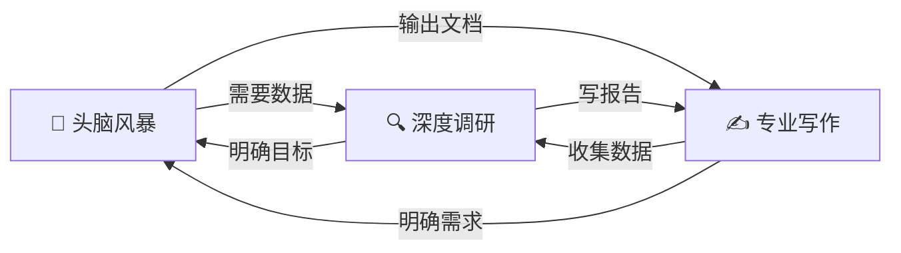

<h1 align="center">✨ skilless.ai</h1>

<p align="center">
  <strong>赋予 Agent 真实数据超能力</strong>
</p>

<p align="center">
  <a href="LICENSE"></a>
  <a href="https://www.python.org/"></a>
  <a href="https://github.com/brikerman/skilless.ai/stargazers"></a>
</p>

<p align="center">
  <a href="#快速安装">快速安装</a> · <a href="README.md">English</a> · <a href="#四大工具">核心工具</a> · <a href="#三大技能">AI 技能</a> · <a href="https://skilless.ai">官网</a>
</p>

---

## 为什么需要 Skilless？

你的 AI 写东西很厉害，但让它去网上找点信息，它就傻了：

- 🔍 "帮我搜一下这款产品的评价" → **没有好用的免费搜索**，要么付费要么质量差
- 🌐 "帮我看看这个网页写了啥" → **抓回来一堆 HTML 标签**，根本没法读
- 📺 "这个 YouTube 视频讲了什么" → **拿不到字幕**，手动处理太麻烦
- 📡 "帮我追踪这几个新闻源，有更新告诉我" → **要自己装库写代码**

**Skilless 把这件事变成一行命令：**

```bash
curl -LsSf https://skilless.ai/install | bash
```

自动检测环境、创建隔离虚拟环境、安装所有依赖。不污染系统，不需要 sudo，随时可卸载。

---

## 安装后能做什么

> 💡 **推荐搭配：** [OpenCode](https://opencode.ai) — 开源免费，和 Skilless 配合开箱即用。也支持 OpenClaw、Kilo Code、Cursor、Claude Code。

直接告诉你的 AI 你想要什么——它读完技能文件，自己知道该怎么做：

- "帮我在网上搜一下这款产品的口碑" → 直接搜索
- "帮我看看这个链接写了什么" → 提取任意网页的干净内容
- "这个 YouTube 视频讲了什么？" → 提取字幕文字
- "帮我看看这个订阅源最近有什么更新" → 解析并总结订阅内容

**你不需要记任何命令。** 这正是 Skilless 的意义所在。

---

## 真实使用场景

### 📹 视频下载
- **YouTube** → 下载视频离线观看、提取字幕、获取文字稿
- **B 站 (Bilibili)** → 保存视频到本地、提取弹幕和字幕
- **抖音、TikTok、Twitter/X、Twitch、Vimeo** → 下载视频、直播回放，去水印保存
- **1700+ 个站点** → Dailymotion、Rumble、Odysee、SoundCloud、Reddit 视频等

### 📝 视频字幕
- 提取任意视频的自动生成或人工字幕
- 整理语速快的视频内容为可阅读笔记
- 翻译视频字幕到其他语言
- 根据字幕生成视频摘要

### 🎵 媒体处理
- 从视频中提取音频转为 MP3
- 压缩大视频文件节省空间
- 格式互转（mkv→mp4、wav→mp3 等）

### 🔍 网页搜索
- "帮我对比一下 2000 元以下的降噪耳机" → 搜索全网评测进行对比
- "最近 AI 视频生成有什么新动态？" → 查找并总结最新文章
- "研究一下 RAG 系统的最佳实践" → 语义搜索技术内容

### 🌐 网页内容
- "帮我读一下这篇文章并总结要点" → 提取干净内容
- "从这个文档中提取关键信息" → 解析技术文档
- "这个页面关于 X 内容说了什么？" → 查找特定信息

### 📊 深度调研
- **多源对比** → "对比市面上的项目管理工具，给 5 人小团队推荐一款"
- **旅行规划** → "制作 7 天东京深度游攻略，包含美食和景点推荐"
- **行业分析** → "调研市面上所有的 AI 视频生成模型，写一份综合报告"
- **事实核查** → 多源交叉验证，确保信息准确

### ✍️ 内容写作
- 撰写任意主题的专业邮件
- 基于真实调研撰写文章
- 创建带引用的文档和报告

---

**真实案例：** 最近有用户问：*"调研市面上所有的视频生成模型，写一份综合报告。"* Skilless 自动搜索、阅读、交叉验证，输出结构化的多章节报告 —— 全程一个对话搞定。

---

## 三大技能

技能以 `SKILL.md` 形式安装到 `~/.agents/skills/`，Agent 自动读取，知道何时调用哪个能力：

| 技能 | 用途 |
|------|------|
| **头脑风暴** | 通过对话将模糊想法转化为可执行计划，提供 2-3 种方案及取舍分析 |
| **深度调研** | 多源交叉验证的深度调研——从静态文本生成器变为主动互联网研究员 |
| **专业写作** | 基于实际调研数据撰写文章、技术文档、报告 |

### 技能生态

三个技能组成一个协作系统——彼此可以在需要时互相调用：



---

## 快速安装

**Mac / Linux**

```bash
curl -LsSf https://skilless.ai/install | bash
```

**Windows (PowerShell)**

```powershell
irm https://skilless.ai/install.ps1 | iex
```

<details>
<summary>这行命令实际安装了什么？（点击展开）</summary>

1. **安装 uv** — 极速 Python 包管理器，装到 `~/.local/bin`
2. **网络检测** — 自动识别网络环境，国内自动切换清华 TUNA 镜像源
3. **隔离部署** — 在 `~/.agents/skills/skilless/` 创建完全隔离的虚拟环境，安装所有依赖：`yt-dlp` `fastmcp` `jina reader` `feedparser`
4. **暴露 CLI** — 生成 `skilless.ai` 可执行文件，即刻可用

*不污染系统环境 · 不需要 sudo · 随时可卸载*
</details>

---

## 技术栈

| 工具 | 用途 |
|------|------|
| [Jina Reader](https://github.com/jina-ai/reader) | 网页提取 |
| [Exa](https://exa.ai) | AI 语义搜索，免费，无需 Key |
| [yt-dlp](https://github.com/yt-dlp/yt-dlp) | 视频与字幕提取，支持 1700+ 站点 |
| [feedparser](https://github.com/kurtmckee/feedparser) | RSS/Atom 解析 |
| [uv](https://github.com/astral-sh/uv) | 极速 Python 包管理器，隔离部署 |

---

## 常见问题

<details>
<summary><strong>需要 API Key 吗？</strong></summary>

不需要。所有工具均使用免费方案：Exa 搜索通过 MCP 免费接入，Jina Reader 无需 Key，yt-dlp 完全本地运行。
</details>

<details>
<summary><strong>会修改系统环境吗？</strong></summary>

不会。所有内容安装在 `~/.agents/skills/skilless/` 目录的隔离虚拟环境中，不需要 sudo，不影响全局 Python 或 Node.js 环境。
</details>

<details>
<summary><strong>支持哪些 AI 工具？</strong></summary>

任何能读取 `~/.agents/skills/` 下 SKILL.md 文件的工具都支持。推荐使用 **[OpenCode](https://opencode.ai)** — 开源免费。也支持 OpenClaw、Kilo Code、Cursor、Claude Code。
</details>

<details>
<summary><strong>如何卸载？</strong></summary>

```bash
rm -rf ~/.agents/skills/skilless
rm -rf ~/.agents/skills/skilless-*
```
</details>

---

## License

[MIT](LICENSE)
