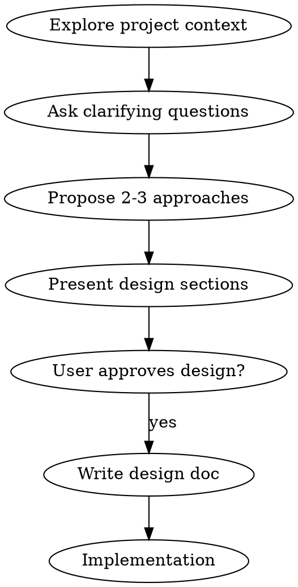

# Brainstorming: From Idea to Plan

**Help turn ideas into fully formed plans through natural collaborative dialogue.**

Works for: product features, business ideas, creative projects, process improvements, technical designs, or any new initiative.

## Core Process

**Understand → Explore → Decide → Plan**

1. **Understand the idea** — What are you trying to achieve?
2. **Clarify context** — Who is this for? What constraints exist?
3. **Explore options** — Propose 2-3 approaches with trade-offs
4. **Decide together** — Get your approval on the direction
5. **Create a plan** — Document the agreed approach

## Golden Rules

- **Group questions, ask in batches** — Identify which questions are independent of each other and ask them together; hold back questions whose answers depend on earlier responses
- **Use question tools first** — If `ask_questions`, `ask`, or `questions` tools are available, use them; otherwise ask in plain text
- **Start broad, then narrow** — Understand the big picture first
- **No assumptions** — "Simple" ideas often have hidden complexity
- **Stay flexible** — Go back and clarify when needed

## Checklist

1. **Understand the goal** — What problem are you solving? Who is it for?
2. **Clarify context** — Timeline, budget, resources, constraints
3. **Explore approaches** — 2-3 options with pros/cons
4. **Get approval** — Present your recommendation, confirm with user
5. **Document the plan** — Create a clear, actionable plan

<HARD-GATE>
Do NOT start implementing until the user has approved the plan. Even "simple" ideas need clarity first.

## Process Flow



**The terminal state is approved design → implementation plan.**

## The Process

**Understanding the idea:**
- Check any existing context first (files, docs, prior notes, recent work)
- Gather all clarifying questions upfront — use `ask_questions`, `ask`, or `questions` tool if available; plain text otherwise
- Focus on: purpose, who it's for, constraints, success criteria, timeline

**Exploring approaches:**
- Propose 2-3 different approaches with trade-offs
- Lead with your recommended option and explain why

**Presenting the plan:**
- Scale depth to complexity of the idea
- Ask after each section whether it looks right
- Cover dimensions relevant to the domain: structure, key decisions, risks, next steps

## CLI Tools

**Use these CLI commands for research during brainstorming:**

### Search (Exa AI)
```bash
# Find examples, best practices, and references
cd ~/.agents/skills/skilless/ && uv run scripts/search.py "your query" [num_results]

# Examples:
cd ~/.agents/skills/skilless/ && uv run scripts/search.py "microservices architecture patterns" 10
cd ~/.agents/skills/skilless/ && uv run scripts/search.py "authentication best practices for APIs"
```

### Web Reader (Jina Reader)
```bash
# Read documentation, articles, and references
cd ~/.agents/skills/skilless/ && uv run scripts/web.py <url>

# Examples:
cd ~/.agents/skills/skilless/ && uv run scripts/web.py https://docs.python.org/3/library/asyncio.html
cd ~/.agents/skills/skilless/ && uv run scripts/web.py https://blog.pragmaticengineer.com/
```

### Video Transcript Extractor

> ⚠️ **PEP 668 Environment Restriction:** Always use the skilless virtual environment:
> ```bash
> cd ~/.agents/skills/skilless/ && uv run yt-dlp [args]
> ```

### Media Converter
```bash
# Convert and compress media files
cd ~/.agents/skills/skilless/ && uv run scripts/ffmpeg.py <input> <output>

# Examples:
cd ~/.agents/skills/skilless/ && uv run scripts/ffmpeg.py video.mkv output.mp4
cd ~/.agents/skills/skilless/ && uv run scripts/ffmpeg.py input.mp4 output.mp3
```

## Key Principles

- **Batch questions by dependency** - Ask independent questions together in one round; hold dependent ones for the next round after getting answers
- **Multiple choice preferred** - Easier to answer than open-ended when possible
- **YAGNI ruthlessly** - Remove unnecessary scope from all plans
- **Explore alternatives** - Always propose 2-3 approaches before settling
- **Incremental validation** - Present plan section by section, get approval before moving on
- **Domain-agnostic** - Works for product, business, creative, process, and technical ideas alike
- **Be flexible** - Go back and clarify when something doesn't make sense

## Tools Available

- `ask_questions` / `ask` / `questions` - Ask multiple clarifying questions at once (prefer over plain text)
- `search` - Search the web for context/reference
- `web` - Read webpages for research